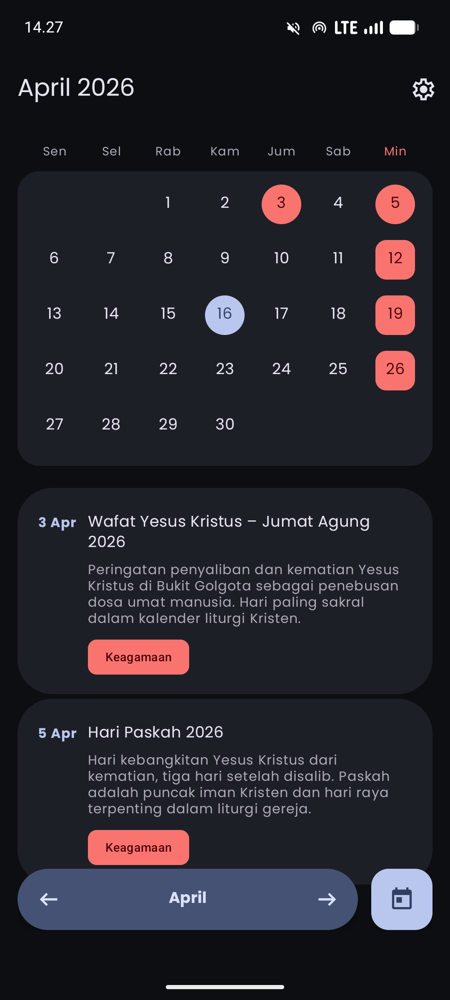
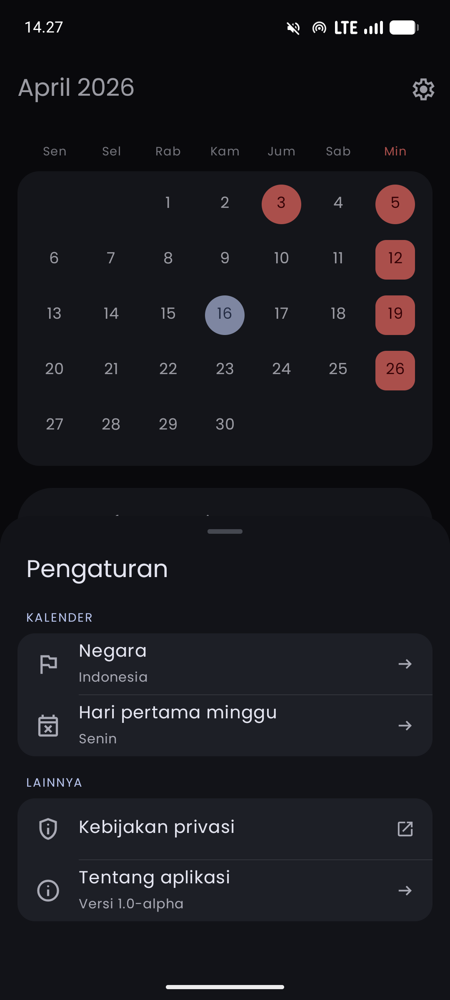
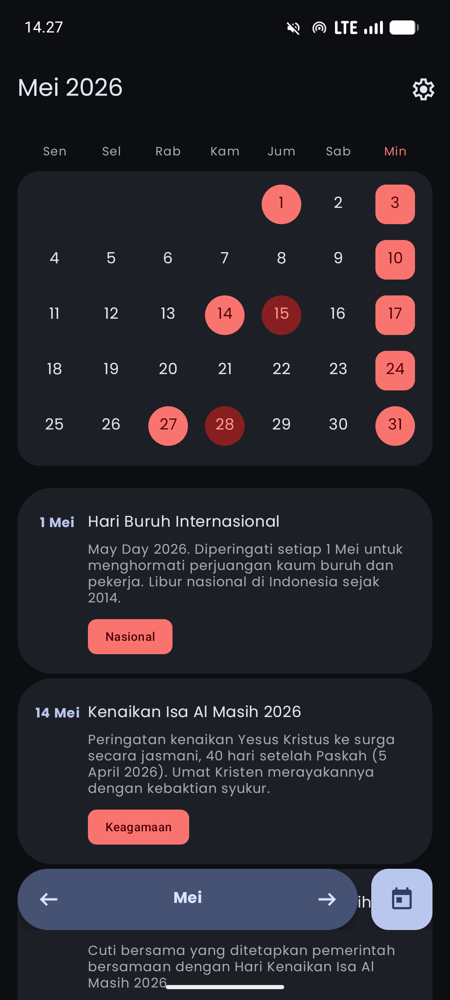

# Kalender

An Indonesian national holiday calendar app with Material 3 design.

> ⚠️ **Alpha Release** — This app is still in early development. Holiday data currently only covers the year **2026**.

[](https://github.com/alfahrelrifananda/kalender/releases)

## Features

- Monthly calendar with swipe navigation between months
- List of national, religious, and joint holidays
- Material 3 design with dynamic color theming
- Supports Android 12+ dynamic color (Monet)
- Lightweight and optimized for performance

## Screenshots

<div style="display: flex; justify-content: space-around; gap: 10px;">
  
  
  
</div>

## Tech Stack

- **Language:** Kotlin
- **UI:** XML Layouts
- **Design:** Material 3 with Dynamic Colors
- **Navigation:** ViewPager2
- **Architecture:** Native Android

## Current Limitations

- Only available in Indonesian
- Holiday data only for the year **2026**
- Still in **Alpha** — features and design may change at any time

## Getting Started

### Requirements

- [Android Studio](https://developer.android.com/studio) (latest stable version)
- Android device or emulator (API 26+)

### Installation

1. Clone this repository:
   ```bash
   git clone https://github.com/alfahrelrifananda/kalender.git
   cd kalender
   ```
2. Open the project in Android Studio.
3. Build and run the app.

## Contributing

Contributions are welcome! If you want to contribute:

- Fork this project
- Open an issue for bug reports or feature requests
- Submit a pull request

## License

This project is licensed under the **GNU General Public License v3.0**. See the [LICENSE](LICENSE) file for more details.
